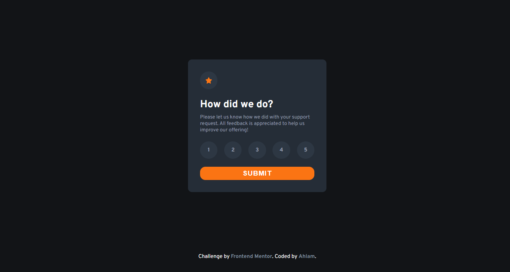

<h1 align="center">Interactive rating component
</h1>

   Solution for a challenge from  <a href="https://www.frontendmentor.io/challenges/interactive-rating-component-koxpeBUmI" target="_blank">frontendmentor.io</a>.

 
 

## Overview

### The challenge

This a challenge for build Interactive rating component which user should be able to:

- View the optimal layout for the app depending on their device's screen size
- See hover states for all interactive elements on the page
- Select and submit a number rating
- See the "Thank you" card state after submitting a rating

## My process

### Built with

- Semantic HTML5 markup
- CSS custom properties
- Flexbox
- Mobile-first workflow

### What I learned

When I first started learning JavaScript it used to be very a hard to understand how to interact with DOM elements. With time, it's getting much easier and I am happy to practice it one more time!

yeah it's still some of my working on proj not a professional ,but i hope in future to become stronger and more creative in writing codes

### Useful resources

- [MDN](https://developer.mozilla.org/en-US/)
- [stackoverflow](https://stackoverflow.com/)

## Acknowledgments

A big thank you to anyone providing feedback on my . It definitely helps to find new ways to code and find easier solutions!
